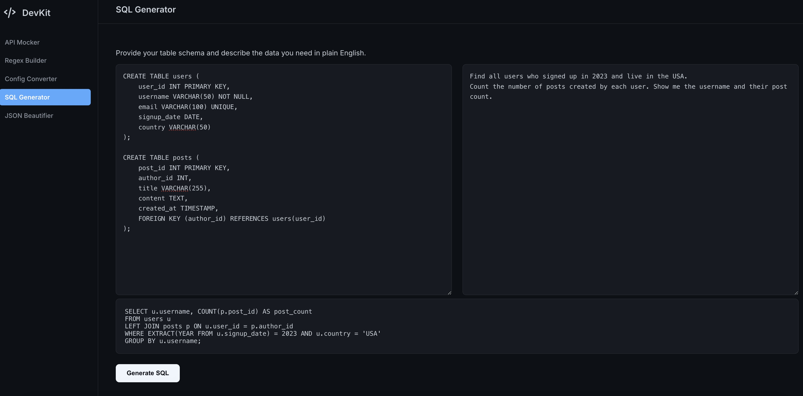

# DevKit - The Ultimate Developer Toolkit

DevKit is a unified, indispensable suite of tools for developers, built with a high-performance **Go** backend and a sophisticated, modern vanilla **JavaScript** frontend. It combines five essential utilities into a single, cohesive, and beautifully designed application that feels fluid, powerful, and a pleasure to use.

This project is a comprehensive demonstration of building a full-stack, API-driven application that is robust, scalable, and meticulously designed from the ground up.

---





---

## ✨ Features

DevKit consolidates five critical developer tools into one elegant workspace:

1.  **Instant API Mocker**
    -   Paste any valid JSON to generate an instant, shareable mock API endpoint.
    -   Perfect for frontend developers who need to build against an API before it's ready.

2.  **AI-Powered Regex Builder**
    -   Describe patterns in plain English (e.g., "a valid email address") and get a battle-tested regex pattern in return.
    -   Includes a step-by-step explanation generated by AI, turning a cryptic tool into a learning experience.

3.  **Universal Config Converter**
    -   Seamlessly convert between `JSON`, `YAML`, and `TOML` with a single click.
    -   Features a beautiful, custom-built segmented control for an intuitive user experience.

4.  **AI-Powered SQL Generator**
    -   Provide a database schema (`CREATE TABLE...`) and a natural language request ("Show me all users from California who signed up this year").
    -   Generates a valid, ready-to-use SQL query, saving time and reducing errors.

5.  **JSON Beautifier & Validator**
    -   Format messy, minified JSON into a clean, indented, and readable structure.
    -   Instantly validates JSON syntax, highlighting errors on failure.

### Core Platform Features
-   **Polished User Experience:** A meticulously designed dark-themed UI that is both beautiful and functional, with fluid animations and a focus on clarity.
-   **Robust Go Backend:** A high-performance `net/http` server with a clean project structure (`cmd`, `internal/handlers`, `internal/services`).
-   **Resilient API Client:** The Gemini service automatically retries failed API calls with exponential backoff to handle temporary service unavailability.
-   **Secure Configuration:** API keys are managed securely using environment variables (`.env` file), never hardcoded.

---

## 🛠️ Tech Stack

| Backend                                | Frontend                     |
| -------------------------------------- | ---------------------------- |
| **Go** (`net/http`)                    | **Vanilla JavaScript (ES6+)**|
| **Gorilla Mux** (for routing)          | **HTML5** (using `<template>`)|
| **Google Gemini API** (for AI tools)   | **CSS3** (custom properties) |
| `gopkg.in/yaml.v3` & `BurntSushi/toml` |                              |

---

## 🚀 Getting Started

### Prerequisites

-   **Go** (version 1.18 or newer).
-   A **Google Gemini API Key** (obtainable from [Google AI Studio](https://aistudio.google.com/app/apikey)).

### Installation & Running

1.  **Clone the repository:**
    ```bash
    git clone https://github.com/YOUR-USERNAME/devkit.git
    cd devkit
    ```

2.  **Set up your environment:**
    -   Create a file named `.env` in the project root.
    -   Add your API key to this file:
        ```
        GEMINI_API_KEY=YOUR_GEMINI_API_KEY_HERE
        ```
    -   *The `.env` file is included in `.gitignore` to keep your secrets safe.*

3.  **Tidy dependencies:** This command will download all necessary Go modules.
    ```bash
    go mod tidy
    ```

4.  **Run the server:**
    ```bash
    go run ./cmd/server/
    ```

5.  **Open the application:** Launch your web browser and navigate to:
    **[http://localhost:8080](http://localhost:8080)**

---

## 📂 Project Structure

The project follows a standard, scalable Go application structure, ensuring a clean separation of concerns.